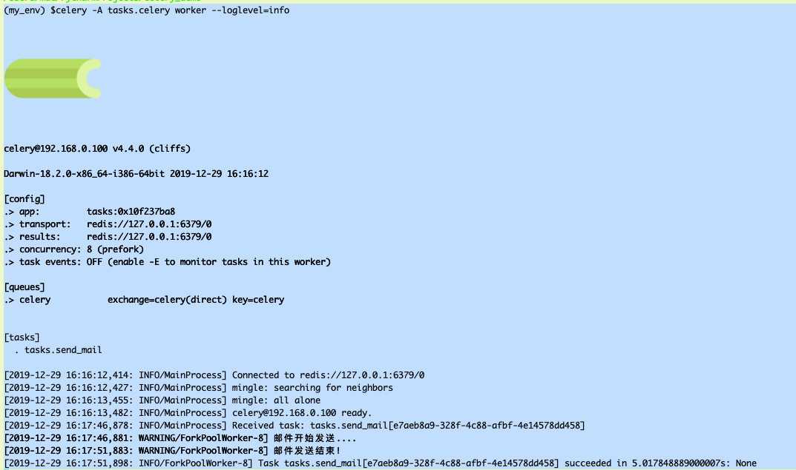

[TOC]

首先需要开启redis服务(看利用docker开启redis服务一文);

```
$docker ps
CONTAINER ID IMAGE COMMAND CREATED STATUS PORTS NAMES
3bde98dfa5de redis "docker-entrypoint.s…" 16 seconds ago Up 15 seconds 0.0.0.0:6379->6379/tcp my_redis
```
这里已经开启;
下面监听任务:
```
(my_env) $pwd
/Users/mac/PycharmProjects/celery_demo
(my_env) $celery -A tasks.celery worker --loglevel=info


celery@192.168.0.100 v4.4.0 (cliffs)

Darwin-18.2.0-x86_64-i386-64bit 2019-12-29 16:16:12

[config]
.> app: tasks:0x10f237ba8
.> transport: redis://127.0.0.1:6379/0
.> results: redis://127.0.0.1:6379/0
.> concurrency: 8 (prefork)
.> task events: OFF (enable -E to monitor tasks in this worker)

[queues]
.> celery exchange=celery(direct) key=celery


[tasks]
  . tasks.send_mail


```

运行Py主程序:




